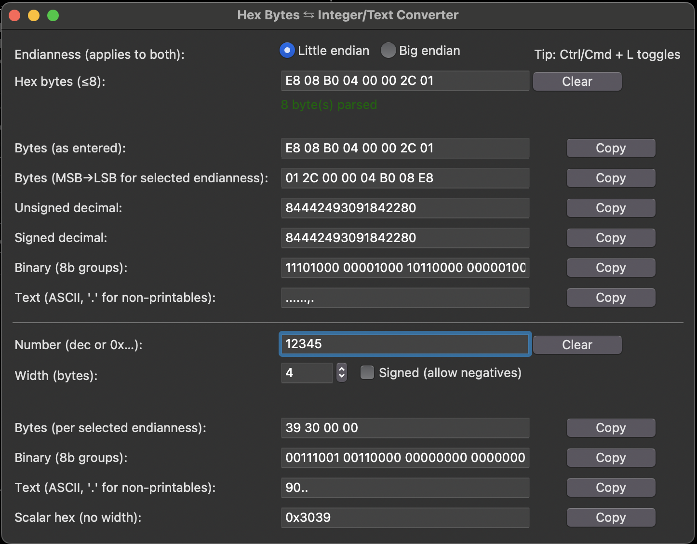

# Hex Converter

A cross-platform **Hex ⇆ Integer/Text Converter** with a simple Tkinter GUI and testable core logic.



---

## Features
- Convert **hex bytes → integers (signed & unsigned)** and ASCII text
- Convert **integers → hex bytes** with custom width and endianness
- Cross-platform: **macOS, Linux, Windows**
- Pure Python, **no external dependencies**
- Includes **unit tests** for all core logic

---

## Installation

Clone the repository and install in **editable mode**:

```bash
git clone https://github.com/Wired-Square/hex-converter.git
cd hex-converter
pip install -e .
